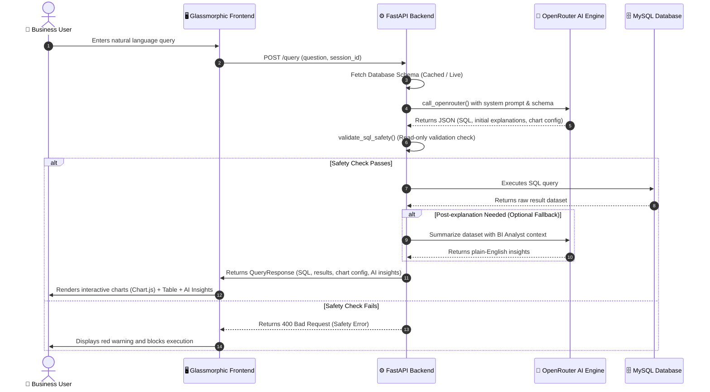

# AI SQL Analytics Assistant 🧠📊

[](https://fastapi.tiangolo.com/)
[](https://www.mysql.com/)
[](https://www.python.org/)
[](https://openrouter.ai/)

A premium, production-grade AI-powered SQL Assistant that converts natural language business questions into valid MySQL queries, executes them safely, and renders data visualizations (Bar, Line, Pie charts) alongside plain-English business insights.

Built using **FastAPI**, **MySQL**, **OpenRouter API**, and a modern, high-fidelity **glassmorphic dark UI** with Vanilla HTML5/CSS3/JS.

---

## 🎨 System Design & Architecture

The application acts as a safe translation layer between natural language and database tables. Below is the system flow mapping how questions are processed, validated, executed, and analyzed.

### Query Flow Infographic



---

## 🗄️ Database Schema & Structure

The default database consists of three relational tables: `customers`, `products`, and `orders`.

| Table Name | Column Name | Data Type | Key Type | Description |
| :--- | :--- | :--- | :--- | :--- |
| **`customers`** | `id` | `INT` | `PRIMARY KEY` | Unique customer identifier |
| | `name` | `VARCHAR` | | Full name of the customer |
| | `email` | `VARCHAR` | | Email address |
| | `city` | `VARCHAR` | | Resident city |
| | `created_at` | `DATE` | | Account creation date |
| **`products`** | `id` | `INT` | `PRIMARY KEY` | Unique product identifier |
| | `name` | `VARCHAR` | | Product catalog name |
| | `category` | `VARCHAR` | | Product category |
| | `price` | `DECIMAL` | | Price in USD |
| **`orders`** | `id` | `INT` | `PRIMARY KEY` | Unique order identifier |
| | `customer_id` | `INT` | `FOREIGN KEY` | References `customers.id` |
| | `product_id` | `INT` | `FOREIGN KEY` | References `products.id` |
| | `quantity` | `INT` | | Number of units purchased |
| | `order_date` | `DATE` | | Purchase date |

---

## 🛡️ SQL Safety & Validation Matrix

To prevent SQL injection attacks and destructive database operations, a regex-based word boundary validator blocks any unapproved commands.

| Operation Type | SQL Verb / Syntax | Allowed? | Rationale / Enforced Guardrail |
| :--- | :--- | :--- | :--- |
| **Read-Only Queries** | `SELECT`, `WITH`, `SHOW`, `DESCRIBE`, `EXPLAIN` | ✅ **YES** | Allows business users to explore database tables and retrieve records freely. |
| **Database Modification** | `INSERT`, `UPDATE`, `DELETE`, `REPLACE` | ❌ **NO** | Blocked to protect database integrity and prevent unauthorized modifications. |
| **Schema Alteration** | `DROP`, `ALTER`, `CREATE`, `TRUNCATE`, `RENAME` | ❌ **NO** | Blocked to prevent schema destruction or unauthorized modifications. |
| **Admin Operations** | `GRANT`, `REVOKE`, `HANDLER` | ❌ **NO** | Blocked to restrict access levels and secure database privileges. |
| **File / Shell Access** | `INTO OUTFILE`, `LOAD DATA`, `EXEC`, `EXECUTE` | ❌ **NO** | Blocked to prevent remote code execution (RCE) and local file system leakages. |
| **Multi-Statement Injections** | `;` (Semicolon separation) | ❌ **NO** | Semicolons are parsed and queries with multiple statements are rejected. |

---

## ⚡ Setup & Execution Procedure (Using `uv`)

Using **`uv`**, an extremely fast Python package manager and runner, setting up and running the application is clean and quick.

### Step 1: Environment Configuration
Create a `.env` file in the root directory:
```ini
# OpenRouter API configurations
OPENROUTER_API_KEY=your_openrouter_api_key_here
OPENROUTER_MODEL=nex-agi/nex-n2-pro:free

# MySQL Connection Details
DB_HOST=localhost
DB_PORT=3306
DB_USER=root
DB_PASSWORD=your_root_password
DB_NAME=ai_sql_assistant
```

### Step 2: Initialize & Seed Database
Ensure your local MySQL server is running, then seed the initial schema and mock data:
```bash
# Force UTF-8 execution on Windows to render emojis correctly
python -X utf8 setup_db.py
```

### Step 3: Virtual Environment Setup with `uv`
If you do not have `uv` installed, install it via pip or your preferred package manager:
```bash
pip install uv
```

Now create a virtual environment, activate it, and sync dependencies:
```bash
# Create virtual environment
uv venv

# Activate venv (Windows PowerShell)
.venv\Scripts\Activate.ps1

# Activate venv (macOS/Linux)
source .venv/bin/activate

# Install all required packages
uv pip install -r requirements.txt
```

### Step 4: Run the Application Server
Run the FastAPI backend with uvicorn:
```bash
uvicorn app:app --reload --port 8000
```
Open your browser and navigate to 👉 **`http://localhost:8000`** to access the dashboard.

---

## 🧪 Testing

We verify the SQL Safety Validator rules against a suite of safe/unsafe test cases:
```bash
python test_app.py
```

---

## 📡 API Usage Reference

### `POST /query`
Submits a natural language query for processing.

**Request Body:**
```json
{
  "question": "Show top 5 customers by number of orders",
  "session_id": "test_session_123"
}
```

**Response (200 OK):**
```json
{
  "sql": "SELECT c.id, c.name, COUNT(o.id) as order_count FROM customers c JOIN orders o ON c.id = o.customer_id GROUP BY c.id, c.name ORDER BY order_count DESC LIMIT 5",
  "results": [
    { "id": 1, "name": "Alice Johnson", "order_count": 4 },
    { "id": 2, "name": "Bob Smith", "order_count": 3 }
  ],
  "explanation": "Here are the top customers. **Alice Johnson** is in first place with **4 orders**, followed closely by **Bob Smith** who has **3 orders**.",
  "chart_recommendation": {
    "type": "bar",
    "xAxisColumn": "name",
    "yAxisColumn": "order_count"
  },
  "sql_explanation": "This query joins the customers and orders tables on the customer_id, groups the results by customer name and ID to aggregate the orders, and sorts them in descending order to output the top 5.",
  "safety_passed": true,
  "execution_time_ms": 142.5
}
```
